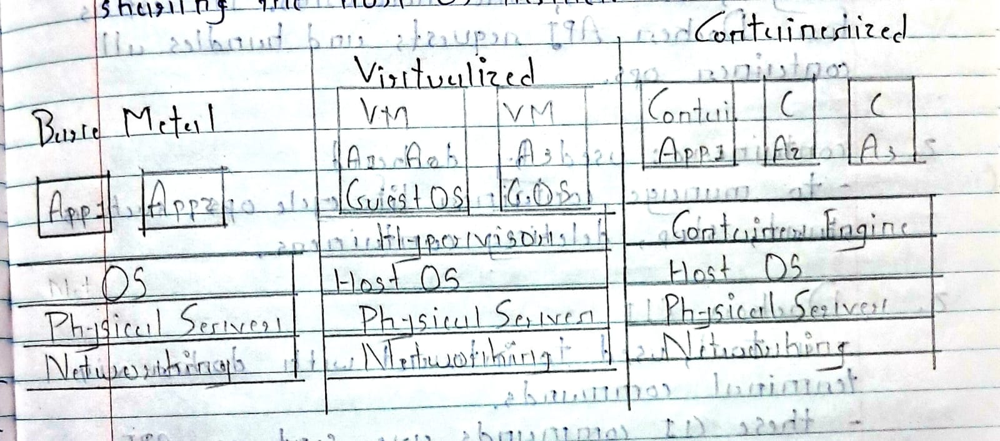

# Docker Basics

## Host OS and Guest OS


**Host OS**: This is the main operating system that runs on your physical computer hardware and manages the system's resources.
- **Examples** include Windows and macOS.

<br>

**Guest OS**: This operating system runs on a Virtual Machine (VM). A VM is a software-based emulator of a computer that allows multiple operating systems to run on a single physical machine.


<br>

## Virtual Machines

- A VM is a **software-based computer** that **runs on top of another computer's OS**.

- It's a software **emulation of a physical computer**.

- VMs **provide a complete environment**, including CPU, memory, storage, and other components.


<br>

## How VMs Work & Hypervisors 

**Hypervisor**: This is a type of software that **creates and manages VMs**. It **allocates resources from the host machine to the VMs**. Each **VM has its own OS, apps, and configuration**.

- A hypervisor acts as **an interface between the hardware and the VMs**. It abstracts the physical hardware, creating a virtual environment where different OS and applications can coexist.

<br>

**VM vs. Hypervisor**: A **hypervisor** is the software that enables multiple VMs to run on a single physical machine. A **VM**, on the other hand, is the **virtualized instance of a computer**, complete with its own OS and apps, managed by a hypervisor.

<br>

## Types of Hypervisors 📚 

**Bare-Metal (Type 1)**: Installed directly on the computer's hardware. It manages hardware resources and allocates them directly to the VMs.

**Hosted (Type 2)**: Installed as an application on top of an existing operating system.


<br>

## OS-Level Virtualization (Containerization)

- Also known as **containerization**.

- This server virtualization method **uses a single OS kernel** to create multiple isolated user-space instances called **containers**.

- These containers share the host OS kernel but each has its own isolated environment, including a root file system, libraries, and dependencies.

- This differs from traditional virtualization where each VM has its own full OS.

<br>

## What is Docker? 🐳 

- Docker is **a software-based platform** that uses **OS-level virtualization to deliver software in packages** called containers.

- Containers include everything an application needs to run, such as code, runtime, libraries, and tools.

- They are lightweight, portable, and self-sufficient.

- Docker enables developers to build, test, and deploy applications quickly and efficiently, ensuring consistent performance across different environments.


<br>

## Docker Containers 


- Containers are **isolated environments for running applications**.

- They are **lightweight because they share the host OS's kernel**, unlike VMs which have their own OS.

- Containers **ensure consistency across different environments** because they package all dependencies for the application.


<br>

## What is WSL? (Windows Subsystem for Linux) 

- WSL is **a compatibility layer developed by Microsoft**.

- It **allows users to run a Linux environment** directly on Windows.

- This enables the use of Linux command-line tools, utilities, and applications (including various distributions) alongside traditional Windows applications, without the need for a VM or dual boot setup.

Basic WSL Commands:
```bash

wsl --install 

wsl --install -d <distroname> 

wsl 

wsl -l 

wsl --list 

wsl -l -v 

wsl --shutdown 
```


## Docker Image

- A Docker image is **a template containing instructions** for executing a Docker container.

- It's essentially **a blueprint that packages an application's code, runtime, tools, libraries, and other dependencies**.

**How it's created**

- Images are **usually created using a Dockerfile**, where you **define step-by-step instructions** (like installing libraries, copying source code, setting up environment variables).

- Once an image is built, it **can be replicated to run multiple containers** consistently across environments.

- You don't always have to write your own Dockerfile; you **can pull pre-built official images from Docker Hub**.


<br>

## Virtualization vs. Containerization 

<br>

| **Feature**      | **Virtualization**                                                                                   | **Containerization**                                                                                             |
| ---------------- | ---------------------------------------------------------------------------------------------------- | ---------------------------------------------------------------------------------------------------------------- |
| **Method**       | Involves creating VMs on top of a host OS using a hypervisor.                                        | Allows you to run multiple isolated applications in containers on the same host system using a container engine. |
| **OS Usage**     | Each VM has its own full OS, along with the application and all necessary libraries.                 | Containers share the host OS kernel and only package the application and its dependencies.                       |
| **Resource**     | Each VM includes a complete OS, consuming more CPU, memory, and storage — making it **heavyweight**. | Containers are **lightweight**, fast to start, and efficient in resource usage.                                  |
| **Startup Time** | VMs take longer to start because they boot their own OS.                                             | Containers are fast to start because they share the host OS kernel.                                              |
| **Isolation**    | Hypervisor creates isolated VMs, each with its own OS.                                               | Containers create isolated instances that share the host OS kernel but have their own separate environment.      |

<br>



<br>

## Docker Architecture 🏗️ 

The core components of Docker architecture include:

1. **Docker Engine**: This is the **core component that runs on the host machine** and is **responsible for building, running, and managing containers**. It includes:

    - **Docker Daemon (`dockerd`)**: A **background service** that manages Docker objects like containers, images, volumes, and networks. It listens for Docker API requests and handles all container operations.

    - **containerd**: **Used by `dockerd`** to **manage container lifecycle operations**, such as starting, stopping, and deleting containers.

2. **Docker CLI (Command Line Interface)**: This is a tool used **to interact with Docker by sending terminal commands**. These CLI commands are **sent as API requests to `dockerd`**, which then performs the requested action through `containerd` and the Docker Engine.

<br>

**How Docker Works Together**
1. You enter a command using the Docker CLI.

2. The CLI sends the request to dockerd.

3. dockerd uses containerd to manage the containers.

4. The task is executed by the Docker Engine, and you see the result on your terminal.

<br>

## Docker Commands 🚀 

<br>

**Image Management**

`docker login`: Used to log in to Docker Hub or another registry.

`docker pull <image-name>`: Downloads an image locally (e.g., docker pull hello-world).

`docker images`: Lists available images on your local machine.

---

**Container Management**

`docker run <image-name>`: Runs a container from an image (e.g., docker run hello-world).

> Note: Running without flags might block your terminal if it's a long-running container.

Run in detached mode (-d): Use `docker run -d <image-name>` to run the container in the background.

`docker stop <container-id>`: Stops a running container.

`docker kill <container-id>`: Forcefully stops a container.

`docker ps`: Views only running containers.

`docker ps -a`: Views all containers (running and stopped).


---


