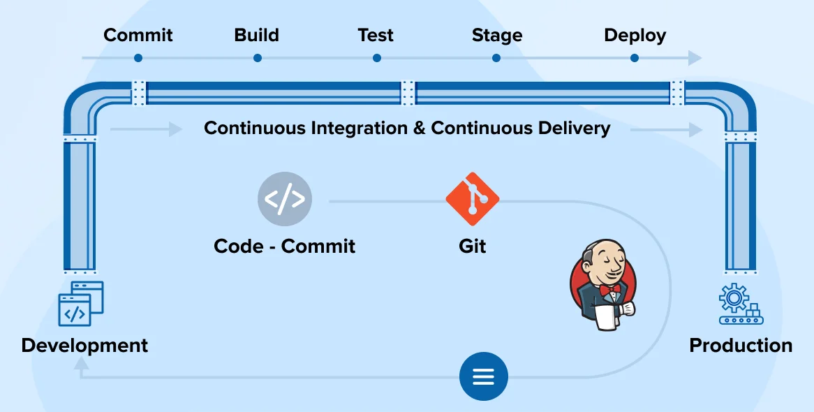

# What is CI/CD?
CI/CD stands for **Continuous Integration** and **Continuous Delivery/Deployment**. It is a process used in software development **to deliver updates to users more quickly and reliably**.

### Continuous Integration (CI)
Continuous Integration means that **developers frequently push their code changes to a shared repository**, like GitHub. Every time new code is pushed, **an automated system (such as Jenkins) checks whether the code can be successfully built and tested**.

For example, if five developers are working on the same project, they will all push their changes to the same repository. CI ensures that their code works well together by building and testing the project after every change. This helps to catch errors early and avoid last-minute surprises.

So, Continuous Integration is mainly about **automating the build and test process every time code is added or changed**.

 

### Continuous Delivery (CD)
Once the code passes the build and testing process (which happens during CI), it is then prepared for deployment. In Continuous Delivery, the system makes sure that the application is always in a deployable state. The deployment to production, however, is done manually — someone from the team can review the changes and trigger the deployment when ready.

So, Continuous Delivery helps **ensure that the latest version of the application is always ready to go live**, but the actual deployment step **requires manual approval**.

 

### Continuous Deployment (CD)
Continuous Deployment is similar to Continuous Delivery but with one major difference — there is **no manual step before deployment**. Once the code passes all tests, it is **automatically deployed to production**. This means users can get new features, bug fixes, or updates as soon as they are ready,** without any human involvement**.

It **requires a strong testing and monitoring setup**, because if something goes wrong, it will go live automatically.

 

### Summary
To summarize, CI/CD is a process **to automate software building, testing, and releasing**. CI handles the build and test automation, while CD handles the release and deployment part. 

Continuous Delivery keeps the deployment step manual, whereas Continuous Deployment makes it fully automatic.

This process helps teams deliver software faster, with fewer errors, and with more confidence.