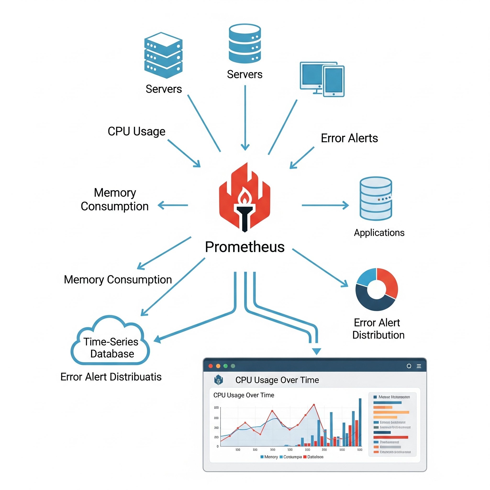
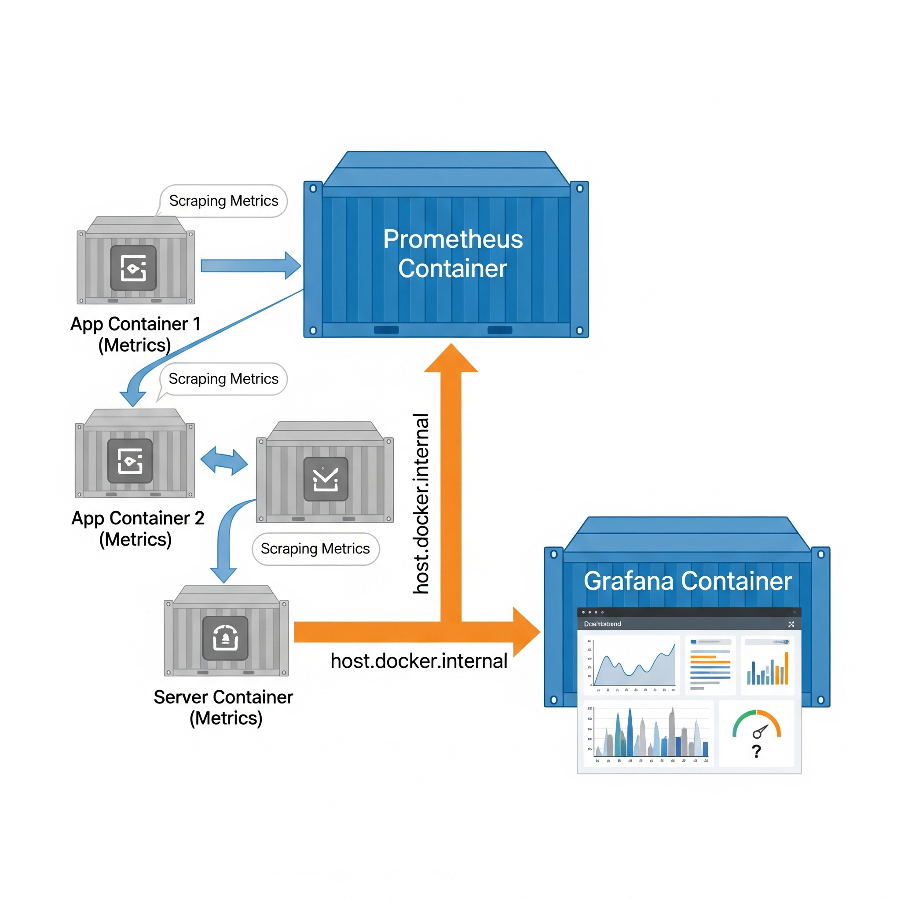
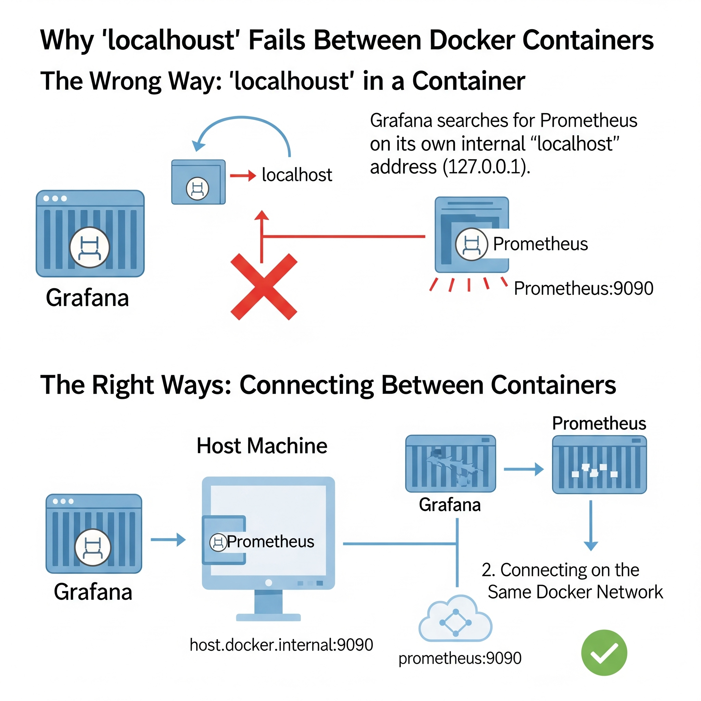

| 11th August, 2025 | Monday |
| :--- | :--- |

---

## What is Prometheus?

| Text | Image |
| :--- | :--- |
| Prometheus is **a tool that collects and stores information** about how your systems, applications, and servers are working. It **regularly checks different places for details** like CPU usage, memory usage, errors, or how fast something is running. It **saves this information over time** so you can see both the current state and the past performance. |  |

---

## What is Grafana?

| Text | Image |
| :--- | :--- |
| Grafana is **a tool that takes the information from Prometheus and shows it in a clear and visual way**, such as graphs, charts, and dashboards. This makes it **much easier to understand the data and spot** if something is going wrong or improving. |  |

---

## When used in Docker

| Text | Image |
| :--- | :--- |
| **Prometheus** runs inside one container **to collect the data**. **Grafana** runs in another container **to display that data**. They **communicate with each other** using network connections provided by Docker. Instead of **`localhost`**, we often use **`host.docker.internal`** so **containers can talk to the host machine or each other properly**. |  |

---

## Why Prometheus and Grafana are Required

| Text | Image |
| :--- | :--- |
| Imagine you manage an online clothing store. Your website, payment service, database, and shipping system are **all running on different servers or containers**. At any time, something could slow down or fail. <br><br> **Prometheus** will **automatically check all these systems every few seconds and record their performance and health**. It will store data like “CPU is 85%”, “Database took 2 seconds to respond”, or “Number of failed logins”. <br><br> **Grafana** will **take this data and show you on a live dashboard with graphs and alerts**. This way, you can quickly notice issues and take action before customers complain. <br><br> > Without these tools, you’d only know something is wrong when customers start calling — which is too late. |  |

---

## Why Not Use `localhost` Inside Docker?

| Text | Image |
| :--- | :--- |
| In Docker, `localhost` inside a container means “**this container itself**”, not your real computer or other containers. <br><br> **Real-world example**: If you tell Grafana to get data from `localhost:9090`, **Grafana will look for Prometheus inside its own container** — but Prometheus is in a different container, so it won’t find it. <br><br> Instead, we use networking solutions provided by Docker. It’s like sending a letter — you have to write the proper address so it reaches the right place. <br><br> - If Prometheus is on your **host machine** (outside Docker), you use `host.docker.internal` from the Grafana container to reach it. <br> - If Prometheus is in **another container**, the best practice is to use a shared Docker network and connect using the container name (e.g., `prometheus:9090`). |  |

---

## Connection Options in Practice

### Option 1 — Using a Shared Docker Network
This is the **best practice** for container-to-container communication. Containers can talk to each other using their names as hostnames.

```bash
# 1. Create a dedicated network
docker network create monitoring

# 2. Start Prometheus on the 'monitoring' network
docker run -d --name prometheus --network monitoring -p 9090:9090 prom/prometheus

# 3. Start Grafana on the same network
docker run -d --name grafana --network monitoring -p 3000:3000 grafana/grafana

# ==> Grafana Data Source URL: http://prometheus:9090
```
> Here, `prometheus` is the container name, resolvable via Docker's internal DNS because both containers share the same network.

### Option 2 — Using `host.docker.internal`
Useful when a container needs to reach a service running on the host machine.

```bash
# 1. Start Prometheus on the host machine (or in Docker, exposing a port)
docker run -d --name prometheus -p 9090:9090 prom/prometheus

# 2. Start Grafana in a container
docker run -d --name grafana -p 3000:3000 grafana/grafana

# ==> Grafana Data Source URL: [http://host.docker.internal:9090](http://host.docker.internal:9090)
```
> Here, `host.docker.internal` lets the Grafana container reach the host machine’s network, which then forwards the request to Prometheus via the exposed 9090 port.
```
</markdo